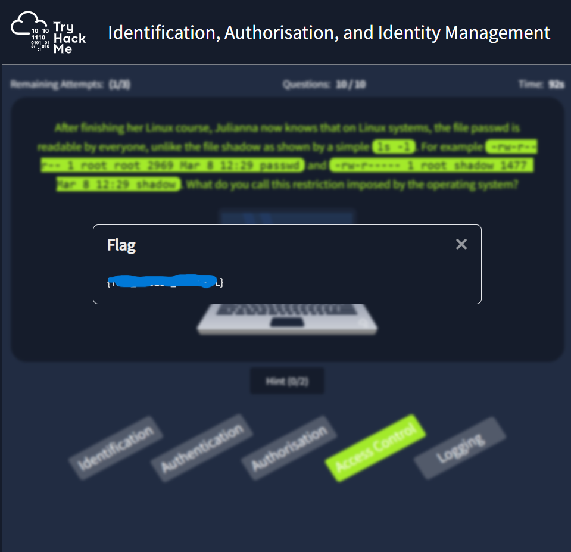

# Section 4 — Identify and Access Management

**🔗 Link:** [TryHackMe — Identify and Access Management](https://tryhackme.com/room/iaaaidm)

---

## 🧠 What this section covers
> Learn about identification, authentication, authorisation, accounting, and identity management.

---
## 📘 Content
- ### Introduction

  Have you ever thought about any of the following questions?

  1. How can we uniquely identify the different system users?
  2. How can a user prove who they are to the system?
  3. How can we help prevent an attacker from pretending to be a legitimate user?
  4. How can we decide what a user should access? How can we enforce such a decision?
  5. How can we know what a user is doing after logging in so that we can hold them accountable for their actions?

  In this room, we answer the above questions and others using formal technical terms. If you are curious, the answers to the questions above lie in the following concepts and processes:

  1. Identification
  2. Authentication
  3. Strong passwords and Multi-Factor Authentication (MFA)
  4. Authorisation and Access Control
  5. Logging and Auditing

  This room introduces the reader to key concepts related to managing identities and authorisations. It starts with identification and authentication and proceeds to accountability before it concludes with access control models.

  Prerequisites  
  Although this room has no strict prerequisites, it is recommended that you first finish the Security Principles to make the best use of this room.

  Learning Objectives  
  By the end of this room, you should have gained a solid understanding of the following processes and concepts:

  - Identification
  - Authentication
  - Authorisation
  - Accountability
  - Access Control Models
  - Single Sign-On  

  Answer the questions below
  
  | Question | Answer |
  |-----------|--------|
  | — | No answer needed |

- ### IAAA Model

  Identification, Authentication, Authorisation, and Accountability (IAAA) are four pillars of information security. Each of these elements plays an essential role in ensuring the confidentiality, integrity, and availability of sensitive information and resources.

  

  In the IAAA Model, IAAA stands for Identification, Authentication, Authorization, and Accountability. The four stages of the IAAA model are:

  1. Identification is the process of verifying who the user is. It starts with the user claiming a specific identity. The identity can be represented by a unique identifier such as an email address, a username, or an ID number. Any identifier unique in the respective environment is a valid option; hence, many websites would rely on an email address for identification instead of asking the user to create a unique username.
  2. Authentication is the process of ensuring that the user is who they claim to be. In other words, this step is about confirming the claimed identity. One way to authenticate would be by providing the correct password. Because of potential password weaknesses, many other methods, such as asking users to type the code sent to their email, are gaining popularity.
  3. Authorisation determines what the user is allowed to access. In other words, they will be authorised to carry out specific operations based on their account privileges. This process is typically done by assigning roles and permissions based on the user’s job function or level of clearance. The risk of unauthorised access or data breaches is reduced by restricting access to only the resources necessary for the user to perform their duties.
  4. Accountability tracks user activity to ensure they are responsible for their actions. After a user is granted access to a system, it is essential to have mechanisms that hold everyone accountable for their actions. This process is achieved by logging all user activity and storing it in a centralised location. In the event of a security incident, this information can be used to identify the source of the problem and take appropriate action.
IAAA helps prevent unauthorised access, data breaches, and other security incidents. By implementing these best practices, organisations can protect their sensitive information and resources from internal and external threats.

  Answer the questions below
  
  | Question | Answer |
  |-----------|--------|
  | You are granted access to read and send an email. What is the name of this process? | Authorisation |
  | Which process would require you to enter your username? | Identification |
  | Although you have write access, you should only make changes if necessary for the task. Which process is required to enforce this policy? | Accountability |

- ### Identification

  Identification is how a user (or process or system) claims a specific identity. Let’s consider a couple of examples from our everyday life. Let’s say you were invited to a party and started socialising, then someone asks you, “What’s your name?” And most likely, you would tell them your real name. After all, you are there to have a good time and make new friends. Wait a minute; you can also make a name or pick something from your favourite movie and answer with something like “Thomas Anderson”! Either way, the other person would not ask for your ID to prove your identity; it is just a socialising event, not accessing a high-security area.

  Identification can be through a username. A username can be of various forms. For instance, Thomas Anderson might be tanderson, thomasa, thomas01, ta001 or even neo. It all depends on the organisation and the platform.

  Identification can also be achieved through a number such as:

  - National ID number
  - Student ID number
  - Passport number
  - Mobile phone number

  Any number unique to the user might be used for identification. Many websites ask for an email address for registration because a user’s email is guaranteed to be unique; this spares the user from trying to find a unique username and remembering it.

  Let’s consider another example outside computers. You just started going to a gym, and the receptionist asked you for your name. You might reply with a name from your favourite movie; however, the receptionist can ask you for your ID card this time. Why would they do that? To confirm that you are who you are claiming to be, that’s authentication. They don’t want to let some random guy enter their gym and proclaim the name of one of their paid subscribers. If anyone can enter and claim to be a subscriber, the gym owners won’t be able to have a profitable business.

  Without proper authentication, severe damage can be incurred; consider the case of someone claiming a fake identity when taking a loan from the bank. In the IT world, without authentication, anyone could access your email if they knew your email address. Most systems cannot function properly without proper authentication; systems are not limited to computer systems and include banking systems, hotel reservation systems, and flight systems, among many others. In the next task, we cover authentication in more detail.  

  Answer the questions below
  
  | Question | Answer |
  |-----------|--------|
  | Which of the following cannot be used for identification? 1. Email address 2. Mobile number with international code 3. Year of birth 4. Passport number | 3 |
  | Which of the following cannot be used for identification? 1. Landline phone number 2. Street number 3. Health 4. insurance card number | 2 |

- ### Authentication

  Authentication is the process of verifying the identity of a user or system. Let’s go back to our gym example. The receptionist at the gym only allows subscribed members. How is this achieved in the analogue world? They can ask you for your gym membership card (assuming the gym provides one for each subscriber). You should have a gym membership card with your photo and relevant gym subscription details. The receptionist can confirm your identity by checking your card; the authentication problem is solved (unless someone finds a way to counterfeit the card, but that’s another problem).

  Authentication and identification are core components of any information system and network. It is essential to understand the difference between authentication and identification.

  During identification, the user (or system or process) claims a specific (unique) identity in the respective settings. Authentication is proving the identity of the user (or system or process). This process is usually accomplished through one of the following ways:

  1. Something you know
  2. Something you have
  3. Something you are

  Two more methods are used, although to a lesser degree:

  - Somewhere you are (logical/physical location)
  - Something you do (behaviour)

  Let’s discuss each of the three main authentication mechanisms.

  Something You Know
  Something you know refers to something that you know or have memorised. Examples include the following:

  - Passwords such as 4SNoPawKkdFiCdnm and %WAdWi-;4,mxRMQB
  - Passphrases such as “Judge Battle Advise Pain 9” and “Baggage Protection Dissatisfy Barrel 8”
  - PIN (Personal Identification Number) such as 25063 and 6285
 
  Most mobile phones are automatically locked within minutes of inactivity. Depending on the original configuration, the user can unlock them by providing the correct PIN, password, or pattern. Although drawn, a pattern is no different than a PIN, i.e., something memorised.

  Consider the case when you log in to TryHackMe. You must identify yourself using a username or email and authenticate your identity using a password. (If you are signing in to TryHackMe with Google, you provide your login credentials to Google, and Google will confirm your identity to TryHackMe.) The username and email are unique to you; hence identification can be carried out without any ambiguity. The password is assumed to be known only to you, proving that you are the account holder.

  Something You Have
  Something you have refers to an object, usually physical, that you have. It can range from a phone to a security key.

  For instance, when you want to register on some instant messaging apps, you are asked to provide a phone number, usually a mobile number. This phone number is your identity on that app. How do you prove that this is indeed your phone number? One way is to send you a code via SMS or call you on that number and communicate the code. Reading the SMS within a few minutes or receiving a call on that number would prove that you have this phone number. In the case of a mobile number, it would be enough proof that you have the SIM card (or eSIM) in your possession.

  A hardware security key is small enough to be carried in the key chain or wallet. You can use the security key for authentication by plugging it into the USB or USB C port or putting it close to an NFC (Near-Field Communication) reader. Examples of hardware security keys include Yubico, Titan Security Key, Nitrokey, and Thetis to name a few.

  Something You Are
  Something you are refers to biometric readers. Examples include fingerprint readers, facial recognition, retina scanners, and voice recognition.

  You have most likely experienced authenticating using a fingerprint reader when trying to unlock your phone. Many modern mobile phones allow the user to authenticate using a fingerprint while keeping the password/PIN/pattern as a backup option in case fingerprint authentication fails.

  Facial recognition is also becoming popular in modern smartphones. Over the years, biometric readers and scanners are becoming not only more reliable but also more affordable. This technology benefits both companies that require high security and consumers.

  Multi-Factor Authentication (MFA)
Multi-factor authentication (MFA) refers to using two or more of the above mechanisms (something you know/have/are). The purpose is to have additional security in case one authentication mechanism gets compromised.

  If you want to use a bank’s ATM, insert your credit/debit card and type your PIN code. This procedure is one of the earliest two-factor authentication (2FA) examples. The apparent utility is that it is not enough for the attacker to get hold of your card, as they would also need to know your PIN code.

  Many of the home safes available today use 2FA without necessarily marketing it. They require the owner to insert a key and enter the correct PIN code for the safe to open. You need to know the PIN and have the key to open it. Consequently, if someone else manages to get hold of the safe key, they still won’t be able to open the safe without knowing the PIN code.

  In iterate, 2FA requires two authentication mechanisms, and it falls under the more general MFA, which requires two or more authentication factors. This requirement can significantly improve security and protect against various attacks, such as those that take advantage of weak passwords.

  Answer the following questions using the correct item number from the numbered list below.

  1. Something you know
  2. Something you have
  3. Something you are
  4. 2FA  

  Answer the questions below
  
  | Question | Answer |
  |-----------|--------|
  | When you want to check your email, you enter your username and password. What kind of authentication is your email provider using? | 1 |
  | Your bank lets you finish most of your banking operations using its app. You can log in to your banking app by providing a username and a password and then entering the code received via SMS. What kind of authentication is the banking app using? | 4 |
  | Your new landline phone system at home allows callers to leave you a message when the call is not picked up. You can call your home number and enter a secret number to listen to recorded messages. What kind of authentication is being used here? | 1 |
  | You have just started working at an advanced research centre. You learned that you need to swipe your card and enter a four-digit PIN whenever you want to use the elevator. Under which group does this authentication fall? | 4 |

- ### Authorisation and Access Control

  Once authenticated, a user should be granted the proper level of access. Authorisation specifies what the authenticated user should be allowed to access and do. Returning to our gym example, we expect a gym-paid member to be authorised to access any training equipment during the set business hours. The subscriber cannot borrow and take the treadmill home for a month. A gym is not a library! Access control mechanisms would ensure that the proper authorisation is enforced. If the gym has an adequate access control mechanism, someone will spot you struggling to carry the treadmill and take it out.

  Let’s consider another non-technical example; Linda reserved a room at a hotel for one week. With this reservation, Linda should be authorised to access her hotel room, among other public facilities, throughout her stay. Although she is allowed to access her assigned guest room, she is not allowed to access other guest rooms, for instance. How can this be enforced? Again, authorisation is enforced by the access control mechanisms.

  In the hotel example, Linda is given a key that grants her access to her assigned room. Consequently, access control is enforced via locks and keys. A more sophisticated hotel might use smart cards and electronic card readers to unlock the room doors. Either way, there is a mechanism that would enforce the authorisation.

  Let’s consider a technical example. As part of the sales team, Edward should be able to access all the files related to sales that are necessary to carry out his work efficiently and effectively. There is no need for the sales team to have access to documents pertaining to human resources and accounting, for example. In this case, access control can be enforced by setting the proper access permissions on the company files and knowledge base.

  In brief, authorisation decides what a user should be able to access, while access control enforces the set policy. For instance, after logging in to your email account, you should be able to read your email messages and send new ones. However, by default, you should not be able to access the inbox of any of your colleagues. The mail server should be designed to allow a user to access their mailbox and deny them access to other users’ mailboxes.

  In the following questions, answer with 1 or 2 to indicate:

  1. Authorisation
  2. Access Control  

  Answer the questions below
  
  | Question | Answer |
  |-----------|--------|
  | The new policy states that the secretary should be able to send an email on the manager’s behalf. What is this policy dictating? | 1 |
  | You shared a document with your colleague and gave them view permissions so they could read without making changes. What would ensure that your file won’t be modified? | 2 |
  | The hotel management decided that the cleaning staff needed access to all the hotel rooms to do their work. What phase is this decision part of? | 1 |

- ### Accountability and Logging

  Accountability ensures that users are accountable for the actions they perform on a system. In other words, after authenticating their identity and getting authorised to access a system, they can be held responsible for their actions. Accountability is possible if we have auditing capabilities, which usually require proper logging functionality.

  Let’s start with a non-technical example: the gym. You have a gym membership and visit the gym thrice a week. Now that you are a regular there, the receptionist recognises you and does not ask you to show your membership card. It is like you are always “logged in” at the gym! You observe that everyone with “access” to the gym abides by certain rules. For instance, no one breaks the wall mirror if they are not satisfied with their progress speed. If they do that, they will have their membership revoked and pay for all damages. In other words, everyone is accountable for their actions. This model makes it convenient for everyone to exercise safely.

  Let’s consider a more technical example, such as a bank teller. Such an employee can view and conduct various transactions on a client’s account. How can we ensure that a rogue employee does not abuse such authorisation? We need to log all the transactions and the relevant details securely. We should be able to audit all conducted transactions and review who did what. Without such ability, we can neither rely on nor trust such a system.

  Logging
  A critical aspect of accountability is logging. Logging is the process of recording events that occur within a system. This process includes user actions, system events, and errors. By logging user actions, an organisation can maintain a record of who accessed what information and when. This record is vital for regulatory compliance, incident response, and forensic investigations.

  With a comprehensive logging system in place, an organisation can trace the actions of any user, identify any anomalies or unauthorised access, and take appropriate action. For example, if an unauthorised user attempts to access sensitive data, the logging system can generate an alert to notify security personnel.

  Logging can also help organisations detect and respond to security incidents. By analysing log data, security teams can identify patterns of suspicious activity, such as repeated failed login attempts or unusual access patterns. This information can then be used to investigate and respond to potential security threats.

  Because accountability is a crucial component of any secure infrastructure, proper care should be taken to ensure that logging is performed properly and securely. Furthermore, depending on the security requirements, logs should be tamper-proof. The reason is that you don’t want the attacker to delete or alter the logs and hide their actions on the network. This is why it is a good practice to set up a separate logging server with one task: receive and store the logs securely. Hence we have log forwarding.

  Log forwarding is the process of sending log data from one system to another. This process often aggregates log data from multiple sources into a central location for more accessible analysis and management. Log forwarding can also be used to send log data to a cloud-based service for storage and analysis.

  There are several benefits to log forwarding. By centralising log data, organisations can more easily analyse and correlate log events from different systems to identify potential security threats. This brings us to Security Information and Event Management (SIEM).

  Logging and SIEM
Security Information and Event Management (SIEM) is a technology that aggregates log data from multiple sources and analyses it for signs of security threats. SIEM solutions can help organisations identify anomalies, detect potential security incidents, and provide alerts to security teams.

  By integrating logging and SIEM, organisations can better understand their system and network activity and oversee potential threats. This integration enables organisations to identify and respond to security threats more effectively.

  Furthermore, the integration of logging and SIEM provides additional benefits such as compliance reporting and forensic investigations. Compliance reporting is an essential part of any organisation’s security framework, and logging helps organisations meet reporting requirements by collecting data necessary for audits. Forensic investigations are crucial in identifying the source and cause of a security incident. Logging and SIEM solutions enable organisations to conduct forensic investigations by providing a detailed system and network activity history.

  Answer the questions below
  
  | Question | Answer |
  |-----------|--------|
  | — | No answer needed |

- ### Identity Management

  Identity Management (IdM) includes all the necessary policies and technologies for identification, authentication, and authorisation. IdM aims to ensure that authorised people have access to the assets and resources needed for their work while unauthorised people are denied access. IdM requires that each user or device is assigned a digital identity.

  IdM helps organisations protect sensitive data and maintain compliance with regulations. It also allows organisations to streamline user access processes, reduce costs associated with identity management, and improve user experience. By implementing an effective IdM strategy, organisations can ensure that their users are authenticated and authorised to securely access the resources they need.

  Some sources refer to IdM and Identity and Access Management (IAM) interchangeably. Other sources consider IdM to be more focused on the security issues related to user identity, such as authentication and permissions. They state that IdM is concerned with managing the attributes and permissions of users, devices, and groups, while IAM is more concerned with evaluating the attributes and permissions and granting or denying access according to the company policy. In this task, we present them as different, although the line between them tends to be vague.

  Identity Management (IdM)
  IdM is an essential component of cybersecurity that refers to the process of managing and controlling digital identities. It involves the management of user identities, their authentication, authorisation, and access control. The main goal of IdM is to ensure that only authorised individuals have access to specific resources and information. IdM systems are used to manage user identities across an organisation’s network.

  IdM systems use a centralised database to store user identities and access rights. They also provide functionalities to manage and monitor user access to resources. IdM systems generally include features such as user provisioning, authentication, and authorisation. User provisioning refers to the process of creating and managing user accounts, while authentication and authorisation refer to verifying the identity of a user and granting access to specific resources.

  IdM systems are critical in organisations where there are multiple systems and applications that require access control. They help to simplify the management of user identities, reducing the risk of unauthorised access to resources. In addition, IdM systems provide a single point of reference for user identity management, which makes it easier for organisations to manage user access rights.

  Identity and Access Management (IAM)
  IAM is a more comprehensive concept than IdM. It encompasses all the processes and technologies to manage and secure digital identities and access rights. IAM systems include a variety of functions, such as user provisioning, access control, identity governance, and compliance management. IAM systems ensure that only authorised users have access to specific resources and data and that their access is monitored and controlled.

  IAM systems provide a comprehensive solution to manage and secure access to resources in an organisation. They integrate with multiple systems and applications, providing a centralised view of user identities and access rights. IAM systems use various technologies to manage access, including role-based access control, multi-factor authentication, and single sign-on.

  IAM systems help organisations comply with regulatory requirements such as HIPAA, GDPR, and PCI DSS. They provide functionalities to manage the lifecycle of user identities, including onboarding, offboarding, and access revocation. In addition, IAM systems allow organisations to track and audit user activity, which helps to prevent security breaches and ensure compliance with industry regulations.

  IdM and IAM are essential components of cybersecurity. They ensure that only authorised individuals have access to specific resources and information. IdM systems manage user identities, while IAM systems encompass broader functions to manage and secure digital identities and access rights.

  Answer the questions below
  
  | Question | Answer |
  |-----------|--------|
  | What does IdM stand for? | Identity Management |
  | What does IAM stand for? | Identity and Access Management |

- ### Attacks Against Authentication

  This task will cover example attacks against a naive authentication protocol. The purpose is to give an idea about the importance of using existing and tested protocols instead of creating a protocol and using it without rigorous peer testing.

  Authentication in the Analogue World
  Let’s say that you belong to a horse-riding club. The club reserves a local restaurant for a weekly meeting. You can chat about your adventures while enjoying your favourite plate. The guard at the door does not know all the club members. So you devise an authentication scheme to allow the guard to decide whether to open the door.

  One of the most basic ideas one would think of is to use a common secret phrase. So anyone who wants to enter needs to say a secret passphrase; no one will be granted entry unless they say, “seven horses” when asked, “How many?”. This authentication mechanism works perfectly fine till an attacker standing nearby eavesdrops and learns your passphrase. Now they gain entry to your private gathering as if they are one of you. It would help if you had something more sophisticated.

  You can plan ten questions with ten different secret answers instead of just one question and one answer; however, an attacker lingering close enough by will eventually learn them all. Using a secure authentication mechanism without resorting to cryptography can be almost impossible. Luckily, for the door guard scenario, it is easy to spot any suspicious persons idling around; otherwise, your whole gathering would be compromised.

  Authentication in the Digital World
The situation on the network is even more challenging to secure. If the user sends their username and password in cleartext, anyone capturing traffic on the network can learn the username and the password. How can we prevent them from learning the login credentials?

  The server and the user can agree on a fixed secret key. Instead of sending the password in cleartext, the user encrypts it using the selected secret key. Whenever users want to log in, they send their username and password encrypted using their assigned secret key. Now the attacker should never be able to learn the password, right? Unfortunately, although they won’t be able to know the password, they can still authenticate. 

  Although the attacker does not know the password, they can still authenticate by replaying the same response. This attack is considered a replay attack. Is there anything we can do to fix this?

  Making the Challenge Response Unique
  An encrypted password that is always the same value is easy to circumvent. We need some mechanism to ensure that the response won’t be reused repeatedly. One approach would be to use the current time and date as part of the response. In other words, the user would send an encryption of the current time (and date) along with the password. Although this requires both parties to synchronise their clocks, it ensures that the response is only valid for a brief time, usually in milliseconds.

  Answer the questions below

  | Question | Answer |
  |-----------|--------|
  | The attacker could authenticate using the user’s response when the authentication protocol required a password encrypted with a shared key. What is the name of the attack? | Replay Attack |

- ### Access Control Models

  A system controls access to various resources based on the chosen model. Some of the common access control models are:

  1. Discretionary Access Control (DAC)
  2. Role-Based Access Control (RBAC)
  3. Mandatory Access Control (MAC)

  Discretionary Access Control
  Many have already used Discretionary Access Control (DAC) when sharing files or folders with friends and colleagues. When using DAC, the resource owner will explicitly add users with the proper permissions.

  Consider the following example. You store your photos on one of the online storage platforms. To share all the images related to your graduation with your family, you add their accounts individually and grant them access to the respective album. Eventually, the album permissions with show a few accounts with view permissions.

  The whole process is straightforward and fully controlled by the data owner. It works very well for sharing with family members or a few company users. However, this can get tricky as you try to scale sharing with many users, especially as a user’s role changes over time. This situation brings us to sharing based on user roles.

  Role-Based Access Control
Role-Based Access Control (RBAC) uses a very intuitive approach. Each user has one or more roles or functional positions; furthermore, they are authorised to access different resources based on their roles.

  An accountant needs to access the company accounting books but does not need to access research and development labs or documents. Consequently, users are put into different groups based on their roles. Authorisation and access will be granted based on the group to which a user belongs.

  Classifying users based on their roles brings many advantages. For instance, if a user is tasked with a new role, all that is required is to add them to the new respective group. Moreover, if the users gave up a particular role, we only need to remove them from the old group. This approach makes maintenance more manageable and more efficient.

  Mandatory Access Control
  An operating system using Mandatory Access Control (MAC) would prioritise security and significantly limit users’ abilities. Such systems are used for specific purposes or to handle highly classified data. Consequently, users do not need to carry out tasks beyond the strictly necessary. In other words, users won’t be able to install new software or change file permissions.

  AppArmor gives the ability to have MAC on a Linux distribution. It is already shipped with various Linux distributions, such as Debian and Ubuntu.

  The SELinux project provides a flexible MAC for Linux systems. It is standard for several Linux distributions, such as Red Hat and Fedora.

  Answer the following questions using the correct item number from the numbered list below.

  1. DAC
  2. RBAC
  3. MAC
 
  Answer the questions below
  
  | Question | Answer |
  |-----------|--------|
  | You are sharing a document via a network share and giving edit permission only to the accounting department. What example of access control is this? | 2 |
  | You published a post on a social media platform and made it only visible to three out of your two hundred friends. What kind of access control did you use? | 1 |

- ### Single Sign-On

  Users need to access various sources to carry out their daily work routines. For instance, they would need to access their email, shared files, and printers, among others. Accessing these resources requires the user to have login credentials for successful authentication. The number of different usernames and passwords makes it quite challenging, especially if the users are rightfully not reusing the same password across multiple systems.

  Single Sign-On (SSO) tackles this problem. Instead of a user having to remember multiple usernames and passwords, they only need to remember a single set of login credentials. They can authenticate themselves to one system, granting them access to the other systems necessary for their work.

  

  Traditionally, a user must create several passwords, such as a password to log in to their computer, another password to check their email, and a third password to access a file share. Recalling this number of passwords can be cumbersome, especially since, ideally speaking, a password should not be reused. The better approach would be to require the user to log in once and grant them access to all the needed services; that’s what SSO does.

  SSO allows organisations to authenticate users once before granting them access to the resources required for their work. We can achieve many advantages from this. We will mention a few.

  - One strong password: Expecting a user to remember a single strong password is more acceptable than asking them to remember ten different strong passwords.
  - Easier MFA: Adding MFA to every different service is a humongous task to accomplish and maintain. With SSO, MFA needs to be enabled and configured once.
  - Simpler Support: Support requests like password reset become more straightforward as they are now confined to a single account.
  - Efficiency: A user does not need to log in every time they need to access a new service.
 
  Answer the questions below

  | Question | Answer |
  |-----------|--------|
  | What does SSO stand for? | Single Sign-On |
  | Does SSO simplify MFA use as it needs to be set up once? (Yea/Nay) | Yea |
  | Is it true that SSO can be cumbersome as it requires the user to remember and input different passwords for the various services? (Yea/Nay) | Nay |
  | Does SSO allow users to access various services after signing in once? (Yea/Nay) | Yea |
  | Does the user need to create and remember a single password when using SSO? (Yea/Nay) | Yea |

- ### Scenarios

  It is worth repeating that we need to have proper processes in place to help protect the security of the data, systems, and networks. Expressing this in technical terms, protecting the security of a system, for example, means protecting the confidentiality, integrity, and availability of that system. And part of the proper processes required includes appropriate identification, authentication, authorisation, access control, accountability, and logging, among others. Inadequacy in any one process results in the weakening of the security of the respective systems. Securing one process won’t replace securing the other processes.

   

  Answer the questions below
  
  | Question | Answer |
  |-----------|--------|
  | Finish the task and capture your own flag	 | {T##_A#####_C######} |

- ### Conclusion

  In this room, we covered the different processes, from identification to logging. We also discussed access control models, SSO, and standards related to authentication and authorisation.

  Answer the questions below
  
  | Question | Answer |
  |-----------|--------|
  | — | No answer needed |

