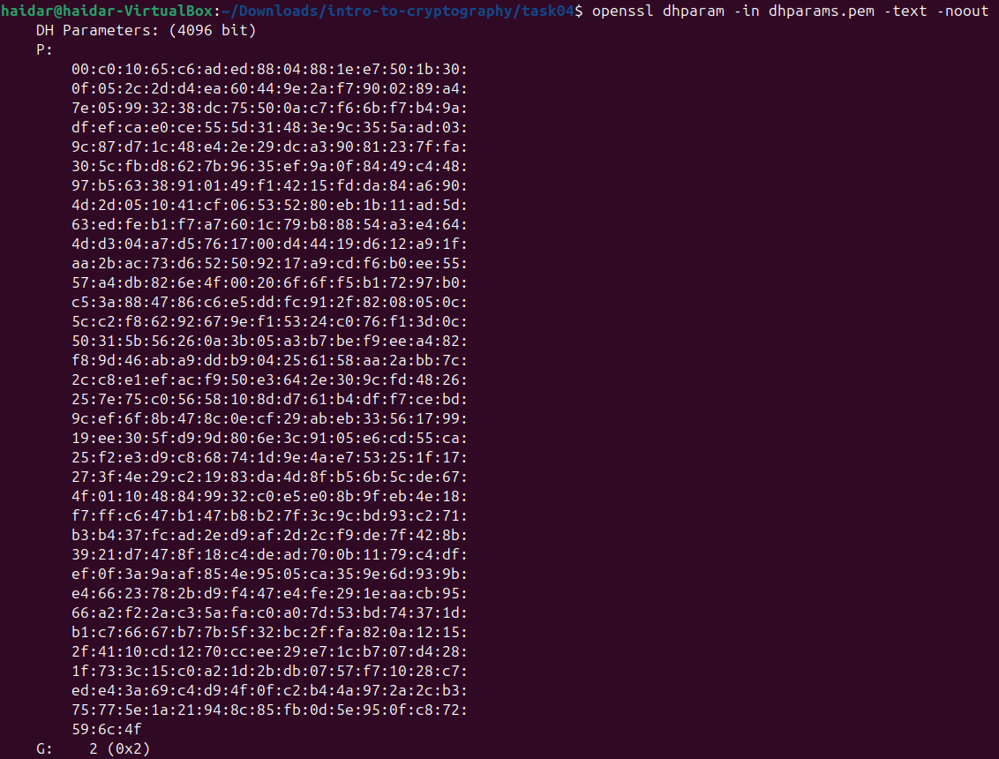
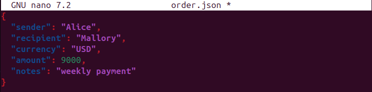

# Section 3 — Introduction to Cryptography

**🔗 Link:** [TryHackMe — Introduction to Cryptography](https://tryhackme.com/room/cryptographyintro)

---

## 🧠 What this section covers
> Learn about encryption algorithms such as AES, Diffie-Hellman key exchange, hashing, PKI, and TLS.

---

## 📘 Content
- ### Introduction

  The purpose of this room is to introduce users to basic cryptography concepts such as:

  - Symmetric encryption, such as AES
  - Asymmetric encryption, such as RSA
  - Diffie-Hellman Key Exchange
  - Hashing
  - PKI

  Suppose you want to send a message that no one can understand except the intended recipient. How would you do that?

  One of the simplest ciphers is the Caesar cipher, used more than 2000 years ago. Caesar Cipher shifts the letter by a fixed number of places to the left or to the right. Consider the case of shifting by 3 to the right to encrypt, as shown in the figure below.
  
  

  The recipient needs to know that the text was shifted by 3 to the right to recover the original message.

  

  Using the same key to encrypt “TRY HACK ME”, we get “WUB KDFN PH”.

  The Caesar Cipher that we have described above can use a key between 1 and 25. With a key of 1, each letter is shifted by one position, where A becomes B, and Z becomes A. With a key of 25, each letter is shifted by 25 positions, where A becomes Z, and B becomes A. A key of 0 means no change; moreover, a key of 26 will also lead to no change as it would lead to a full rotation. Consequently, we conclude that Caesar Cipher has a keyspace of 25; there are 25 different keys that the user can choose from.

  Consider the case where you have intercepted a message encrypted using Caesar Cipher: “YMNX NX FQUMF GWFAT HTSYFHYNSL YFSLT MTYJQ RNPJ”. We are asked to decrypt it without knowledge of the key. We can attempt this by using brute force, i.e., we can try all the possible keys and see which one makes the most sense. In the following figure, we noticed that key being 5 makes the most sense, “THIS IS ALPHA BRAVO CONTACTING TANGO HOTEL MIKE.”

  

  Caesar cipher is considered a substitution cipher because each letter in the alphabet is substituted with another.

  Another type of cipher is called transposition cipher, which encrypts the message by changing the order of the letters. Let’s consider a simple transposition cipher in the figure below. We start with the message, “THIS IS ALPHA BRAVO CONTACTING TANGO HOTEL MIKE”, and the key 42351. After we write the letters of our message by filling one column after the other, we rearrange the columns based on the key and then read the rows. In other words, we write by columns and we read by rows. Also notice that we ignored all the space in the plaintext in this example.  The resulting ciphertext “NPCOTGHOTH…” is read one row after the other. In other words, a transposition cipher simply rearranges the order of the letters, unlike the substitution cipher, which substitutes the letters without changing their order.

  

  This task introduced simple substitution and transposition ciphers and applied them to messages made of alphabetic characters. For an encryption algorithm to be considered secure, it should be infeasible to recover the original message, i.e., plaintext. (In mathematical terms, we need a hard problem, i.e., a problem that cannot be solved in polynomial time. A problem that we can solve in polynomial time is a problem that’s feasible to solve even for large input, although it might take the computer quite some time to finish.)

  If the encrypted message can be broken in one week, the encryption used would be considered insecure. However, if the encrypted message can be broken in 1 million years, the encryption would be considered practically secure.

  Consider the mono-alphabetic substitution cipher, where each letter is mapped to a new letter. For example, in English, you would map “a” to one of the 26 English letters, then you would map “b” to one of the remaining 25 English letters, and then map “c” to one of the remaining 24 English letters, and so on.

  For example, we might choose the letters in the alphabet “abcdefghijklmnopqrstuvwxyz” to be mapped to “xpatvrzyjhecsdikbfwunqgmol” respectively. In other words, “a” becomes “x”, “b” becomes “p”, and so on. The recipient needs to know the key, “xpatvrzyjhecsdikbfwunqgmol”, to decrypt the encrypted messages successfully.

  This algorithm might look very secure, especially since trying all the possible keys is not feasible. However, different techniques can be used to break a ciphertext using such an encryption algorithm. One weakness of such an algorithm is letter frequency. In English texts, the most common letters are ‘e’, ‘t’, and ‘a’, as they appear at a frequency of 13%, 9.1%, and 8.2%, respectively. Moreover, in English texts, the most common first letters are ‘t’, ‘a’, and ‘o’, as they appear at 16%, 11.7% and 7.6%, respectively. Add to this the fact that most of the message words are dictionary words, and you will be able to break an encrypted text with the alphabetic substitution cipher in no time.

  We don’t really need to use the encryption key to decrypt the received ciphertext, “Uyv sxd gyi siqvw x sinduxjd pvzjdw po axffojdz xgxo wsxcc wuidvw.” As shown in the figure below, using a website such as quipqiup, it will take a moment to discover that the original text was “The man who moves a mountain begins by carrying away small stones.” This example clearly indicates that this algorithm is broken and should not be used for confidential communication.

  

  Answer the questions below
  
  | Question | Answer |
  |-----------|--------|
  | You have received the following encrypted message: “Xjnvw lc sluxjmw jsqm wjpmcqbg jg wqcxqmnvw; xjzjmmjd lc wjpm sluxjmw jsqm bqccqm zqy.” Zlwvzjxj Zpcvcol You can guess that it is a quote. Who said it? |  | 

- ### Symmetric Encryption

  Let’s review some terminology:

  Cryptographic Algorithm or Cipher: This algorithm defines the encryption and decryption processes.
Key: The cryptographic algorithm needs a key to convert the plaintext into ciphertext and vice versa.
plaintext is the original message that we want to encrypt
ciphertext is the message in its encrypted form
A symmetric encryption algorithm uses the same key for encryption and decryption. Consequently, the communicating parties need to agree on a secret key before being able to exchange any messages.

  In the following figure, the sender provides the encrypt process with the plaintext and the key to get the ciphertext. The ciphertext is usually sent over some communication channel.


  On the other end, the recipient provides the decrypt process with the same key used by the sender to recover the original plaintext from the received ciphertext. Without knowledge of the key, the recipient won’t be able to recover the plaintext.


  National Institute of Standard and Technology (NIST) published the Data Encryption Standard (DES) in 1977. DES is a symmetric encryption algorithm that uses a key size of 56 bits. In 1997, a challenge to break a message encrypted using DES was solved. Consequently, it was demonstrated that it had become feasible to use a brute-force search to find the key and break a message encrypted using DES. In 1998, a DES key was broken in 56 hours. These cases indicated that DES could no longer be considered secure.

  NIST published the Advanced Encryption Standard (AES) in 2001. Like DES, it is a symmetric encryption algorithm; however, it uses a key size of 128, 192, or 256 bits, and it is still considered secure and in use today. AES repeats the following four transformations multiple times:

  1. SubBytes(state): This transformation looks up each byte in a given substitution table (S-box) and substitutes it with the respective value. The state is 16 bytes, i.e., 128 bits, saved in a 4 by 4 array.
  2. ShiftRows(state): The second row is shifted by one place, the third row is shifted by two places, and the fourth row is shifted by three places. This is shown in the figure below.
  3. MixColumns(state): Each column is multiplied by a fixed matrix (4 by 4 array).
  4. AddRoundKey(state): A round key is added to the state using the XOR operation.

  

  The total number of transformation rounds depends on the key size.

  Don’t worry if you find this cryptic because it is! Our purpose is not to learn the details of how AES works nor to implement it as a programming library; the purpose is to appreciate the difference in complexity between ancient encryption algorithms and modern ones. If you are curious to dive into details, you can check the AES specifications, including pseudocode and examples in its published standard, FIPS PUB 197.

  In addition to AES, many other symmetric encryption algorithms are considered secure. Here is a list of symmetric encryption algorithms supported by GPG (GnuPG) 2.37.7, for example:

  | Encryption Algorithm                          | Notes                                                            |
  |-----------------------------------------------|--------------------------------------------------------------------------|
| AES, AES192, and AES256                        | AES with a key size of 128, 192, and 256 bits                               |
| IDEA                                           | International Data Encryption Algorithm (IDEA)                              |
| 3DES                                           | Triple DES (Data Encryption Standard) and is based on DES. Note: 3DES was deprecated in 2023 and disallowed in 2024.     |
| CAST5                                          | Also known as CAST-128. Some sources state that CAST stands for the names of its authors: Carlisle Adams and Stafford Tavares. |
| BLOWFISH                                       | Designed by Bruce Schneier                                           |
| TWOFISH                                        | Designed by Bruce Schneier and derived from Blowfish                    |
| CAMELLIA128, CAMELLIA192, and CAMELLIA256      | Designed by Mitsubishi Electric and NTT in Japan. Its name is derived from the flower *Camellia japonica*.   |

  All the algorithms mentioned so far are block cipher symmetric encryption algorithms. A block cipher algorithm converts the input (plaintext) into blocks and encrypts each block. A block is usually 128 bits. In the figure below, we want to encrypt the plaintext “TANGO HOTEL MIKE”, a total of 16 characters. The first step is to represent it in binary. If we use ASCII, “T” is 0x54 in hexadecimal format, “A” is 0x41, and so on. Every two hexadecimal digits constitute 8 bits and represent one byte. A block of 128 bits is practically 16 bytes and is represented in a 4 by 4 array. The 128-bit block is fed as one unit to the encryption method.


  The other type of symmetric encryption algorithm is stream ciphers, which encrypt the plaintext byte by byte. Consider the case where we want to encrypt the message “TANGO HOTEL MIKE”; each character needs to be converted to its binary representation. If we use ASCII, “T” is 0x54 in hexadecimal, while “A” is 0x41, and so on. The encryption method will process one byte at a time. This is represented in the figure below.

  

  Symmetric encryption solves many security problems discussed in the Security Principles room. Let’s say that Alice and Bob met and chose an encryption algorithm and agreed on a specific key. We assume that the selected encryption algorithm is secure and that the secret key is kept safe. Let’s take a look at what we can achieve:

  - Confidentiality: If Eve intercepted the encrypted message, she wouldn’t be able to recover the plaintext. Consequently, all messages exchanged between Alice and Bob are confidential as long as they are sent encrypted.
  - Integrity: When Bob receives an encrypted message and decrypts it successfully using the key he agreed upon with Alice, Bob can be sure that no one could tamper with the message across the channel. When using secure modern encryption algorithms, any minor modification to the ciphertext would prevent successful decryption or would lead to gibberish as plaintext.
  - Authenticity: Being able to decrypt the ciphertext using the secret key also proves the authenticity of the message because only Alice and Bob know the secret key.
  
  We are just getting started, and we know how to maintain confidentiality, check the integrity and ensure the authenticity of the exchanged messages. More practical and efficient approaches will be presented in later tasks. The question, for now, is whether this is scalable.

  With Alice and Bob, we needed one key. If we have Alice, Bob, and Charlie, we need three keys: one for Alice and Bob, another for Alice and Charlie, and a third for Bob and Charlie. However, the number of keys grows quickly; communication between 100 users requires almost 5000 different secret keys. (If you are curious about the mathematics behind it, that’s 99 + 98 + 97 + … + 1 = 4950).

  Moreover, if one system gets compromised, they need to create new keys to be used with the other 99 users. Another problem would be finding a secure channel to exchange the keys with all the other users. Obviously, this quickly grows out of hand.

  In the next task, we will cover asymmetric encryption. One of the problems solved with asymmetric encryption is when 100 users only need to share a total of 100 keys to communicate securely. (As explained earlier, symmetric encryption would require around 5000 keys to secure the communications for 100 users.)

  There are many programs available for symmetric encryption. We will focus on two, which are widely used for asymmetric encryption as well:

  - GNU Privacy Guard
  - OpenSSL Project

  GNU Privacy Guard

  The GNU Privacy Guard, also known as GnuPG or GPG, implements the OpenPGP standard.

  We can encrypt a file using GnuPG (GPG) using the following command:

  gpg --symmetric --cipher-algo CIPHER message.txt, where CIPHER is the name of the encryption algorithm. You can check supported ciphers using the command gpg --version. The encrypted file will be saved as message.txt.gpg.

  The default output is in the binary OpenPGP format; however, if you prefer to create an ASCII armoured output, which can be opened in any text editor, you should add the option --armor. For example, gpg --armor --symmetric --cipher-algo CIPHER message.txt.

  You can decrypt using the following command:

  gpg --output original_message.txt --decrypt message.gpg

  OpenSSL Project

  The OpenSSL Project maintains the OpenSSL software.

  We can encrypt a file using OpenSSL using the following command:

  openssl aes-256-cbc -e -in message.txt -out encrypted_message

  We can decrypt the resulting file using the following command:

  openssl aes-256-cbc -d -in encrypted_message -out original_message.txt

  To make the encryption more secure and resilient against brute-force attacks, we can add -pbkdf2 to use the Password-Based Key Derivation Function 2 (PBKDF2); moreover, we can specify the number of iterations on the password to derive the encryption key using -iter NUMBER. To iterate 10,000 times, the previous command would become:

  openssl aes-256-cbc -pbkdf2 -iter 10000 -e -in message.txt -out encrypted_message

  Consequently, the decryption command becomes:

  openssl aes-256-cbc -pbkdf2 -iter 10000 -d -in encrypted_message -out original_message.txt  

  Answer the questions below
  
  | Question | Answer |
  |-----------|--------|
  | Decrypt the file quote01 encrypted (using AES256) with the key s!kR3T55 using gpg. What is the third word in the file? |  |
  | Decrypt the file quote02 encrypted (using AES256-CBC) with the key s!kR3T55 using openssl. What is the third word in the file? |  |
  | Decrypt the file quote03 encrypted (using CAMELLIA256) with the key s!kR3T55 using gpg. What is the third word in the file? |  |

    
- ### Asymmetric Encryption

  Symmetric encryption requires the users to find a secure channel to exchange keys. By secure channel, we are mainly concerned with confidentiality and integrity. In other words, we need a channel where no third party can eavesdrop and read the traffic; moreover, no one can change the sent messages and data.

  Asymmetric encryption makes it possible to exchange encrypted messages without a secure channel; we just need a reliable channel. By reliable channel, we mean that we are mainly concerned with the channel’s integrity and not confidentiality.

  When using an asymmetric encryption algorithm, we would generate a key pair: a public key and a private key. The public key is shared with the world, or more specifically, with the people who want to communicate with us securely. The private key must be saved securely, and we must never let anyone access it. Moreover, it is not feasible to derive the private key despite the knowledge of the public key.

  How does this key pair work?

  If a message is encrypted with one key, it can be decrypted with the other. In other words:

  - If Alice encrypts a message using Bob’s public key, it can be decrypted only using Bob’s private key.
  - Reversely, if Bob encrypts a message using his private key, it can only be decrypted using Bob’s public key.

  Confidentiality

  We can use asymmetric encryption to achieve confidentiality by encrypting the messages using the recipient’s public key. In the following two figures, we can see that:

  Alice wants to ensure confidentiality in her communication with Bob. She encrypts the message using Bob’s public key, and Bob decrypts them using his private key. Bob’s public key is expected to be published on a public database or on his website, for instance.


  When Bob wants to reply to Alice, he encrypts his messages using Alice’s public key, and Alice can decrypt them using her private key.


 
  In other words, it becomes easy to communicate with Alice and Bob while ensuring the confidentiality of the messages. The only requirement is that all parties have their public keys available for interested senders.

  Note: In practice, symmetric encryption algorithms allow faster operations than asymmetric encryption; therefore, we will cover later how we can use the best of both worlds.

  Integrity, Authenticity, and Nonrepudiation

  Beyond confidentiality, asymmetric encryption can solve integrity, authenticity and nonrepudiation. Let’s say that Bob wants to make a statement and wants everyone to be able to confirm that this statement indeed came from him. Bob needs to encrypt the message using his private key; the recipients can decrypt it using Bob’s public key. If the message decrypts successfully with Bob’s public key, it means that the message was encrypted using Bob’s private key. (In practice, he would encrypt a hash of the original message. We will elaborate on this later.)

  Being decrypted successfully using Bob’s public key leads to a few interesting conclusions.

  - First, the message was not altered across the way (communication channel); this proves the message integrity.
  - Second, knowing that no one has access to Bob’s private key, we can be sure that this message did indeed come from Bob; this proves the message authenticity.
  - Finally, because no one other than Bob has access to Bob’s private key, Bob cannot deny sending this message; this establishes nonrepudiation.


  We have seen how asymmetric encryption can help establish confidentiality, integrity, authenticity, and nonrepudiation. In real-life scenarios, asymmetric encryption can be relatively slow to encrypt large files and vast amounts of data. In another task, we will see how we can use asymmetric encryption in conjunction with symmetric encryption to achieve these security objectives relatively faster.

  RSA
  
  RSA got its name from its inventors, Rivest, Shamir, and Adleman. It works as follows:

  1. Choose two random prime numbers, p and q. Calculate N = p × q.
  2. Choose two integers e and d such that e × d = 1 mod ϕ(N), where ϕ(N) = N − p − q + 1. This step will let us generate the public key (N,e) and the private key (N,d).
  3. The sender can encrypt a value x by calculating y = x^e mod N. (Modulus)
  4. The recipient can decrypt y by calculating x = y^d mod N. Note that y^d = x^ed = x^kϕ(N) + 1 = (x^ϕ(N))k × x = x. This step explains why we put a restriction on the choice of e and d.
  
  Don’t worry if the above mathematical equations looked too complicated; you don’t need mathematics to be able to use RSA, as it is readily available via programs and programming libraries.

  RSA security relies on factorization being a hard problem. It is easy to multiply p by q; however, it is time-consuming to find p and q given N. Moreover, for this to be secure, p and q should be pretty large numbers, for example, each being 1024 bits (that’s a number with more than 300 digits). It is important to note that RSA relies on secure random number generation, as with other asymmetric encryption algorithms. If an adversary can guess p and q, the whole system would be considered insecure.

  Let’s consider the following practical example.

  1. Bob chooses two prime numbers: p = 157 and q = 199. He calculates N = 31243.
  2. With ϕ(N) = N − p − q + 1 = 31243 − 157 − 199 + 1 = 30888, Bob selects e = 163 and d = 379 where e × d = 163 × 379 = 61777 and 61777 mod 30888 = 1. The public key is (31243,163) and the private key is (31243,379).
  3. Let’s say that the value to encrypt is x = 13, then Alice would calculate and send y = x^e mod N = 13^163 mod 31243 = 16341.
  4. Bob will decrypt the received value by calculating x = y^d mod N = 16341^379 mod 31243 = 13.

  The previous example was to understand the mathematics behind it better. To see real values for p and q, let’s create a real keypair using a tool such as openssl.


```bash
user@TryHackMe$ cat public-key.pem
-----BEGIN PUBLIC KEY-----
MIIBIjANBgkqhkiG9w0BAQEFAAOCAQ8AMIIBCgKCAQEAymcAeYg1ohPQLHu7u9l1
UutN8bCP7r6czRX2zrQrpElYrm5mHERi1xweWEhTJ/0Q13FJcHLGtLbdQc0rGpOd
DnYJBuzrqXU2hC7E7dlqLsj63NPADqlOGYCGCWnm/HGM2WuVtDXqRitN4zeNKEWI
QmEctfucopZx5AVJ1vTn+qMv/0D6QU7Mm65MTSYg1SCRA0D0N9NLMj4rYlLOIr5q
5g3iunAE4tCROMcHf7fxWMuWdJTdtxTv7+4P5XGkWrWriO22JFHp9N22Fm96V9jH
7aASRkIZvQFmx+1dl7btZDhsm2ezU07LBabv9efj0gIwz6P3mTJVm+wxaDH6jiXB
dwIDAQAB
-----END PUBLIC KEY-----

user@TryHackMe$ openssl rsa -in private-key.pem -text -noout
Private-Key: (2048 bit, 2 primes)
modulus:
    00:ca:67:00:79:88:35:a2:13:d0:2c:7b:bb:bb:d9:
    75:52:eb:4d:f1:b0:8f:ee:be:9c:cd:15:f6:ce:b4:
    2b:a4:49:58:ae:6e:66:1c:44:62:d7:1c:1e:58:48:
    53:27:fd:10:d7:71:49:70:72:c6:b4:b6:dd:41:cd:
    2b:1a:93:9d:0e:76:09:06:ec:eb:a9:75:36:84:2e:
    c4:ed:d9:6a:2e:c8:fa:dc:d3:c0:0e:a9:4e:19:80:
    86:09:69:e6:fc:71:8c:d9:6b:95:b4:35:ea:46:2b:
    4d:e3:37:8d:28:45:88:42:61:1c:b5:fb:9c:a2:96:
    71:e4:05:49:d6:f4:e7:fa:a3:2f:ff:40:fa:41:4e:
    cc:9b:ae:4c:4d:26:20:d5:20:91:03:40:f4:37:d3:
    4b:32:3e:2b:62:52:ce:22:be:6a:e6:0d:e2:ba:70:
    04:e2:d0:91:38:c7:07:7f:b7:f1:58:cb:96:74:94:
    dd:b7:14:ef:ef:ee:0f:e5:71:a4:5a:b5:ab:88:ed:
    b6:24:51:e9:f4:dd:b6:16:6f:7a:57:d8:c7:ed:a0:
    12:46:42:19:bd:01:66:c7:ed:5d:97:b6:ed:64:38:
    6c:9b:67:b3:53:4e:cb:05:a6:ef:f5:e7:e3:d2:02:
    30:cf:a3:f7:99:32:55:9b:ec:31:68:31:fa:8e:25:
    c1:77
publicExponent: 65537 (0x10001)
privateExponent:
    10:fe:00:be:33:3f:3d:72:28:61:f3:a9:59:25:f2:
    81:99:9b:9b:94:d5:20:98:04:15:fb:a8:12:c6:71:
    7b:83:64:dc:90:0c:26:87:5f:3c:eb:f1:68:3b:fa:
    2f:3b:41:b4:b4:a0:13:be:af:0b:f0:e6:36:66:01:
    1e:64:12:25:6a:a7:6b:5b:6c:95:77:6f:b2:3d:32:
    ef:3c:f7:7b:22:08:5d:8d:b1:6c:09:ae:b2:d9:65:
    67:58:ea:b9:7a:d6:f6:51:df:e9:97:35:29:da:ec:
    d9:0c:8a:df:3c:a7:29:db:79:4b:95:ea:1a:84:42:
    df:7f:ca:29:2f:ba:62:02:37:05:c0:b0:c2:ff:42:
    6b:fb:e1:36:40:10:ae:11:0f:d8:87:2f:fe:10:2e:
    a4:60:de:ff:fe:c8:ab:0b:29:fa:6c:20:ec:87:33:
    46:c0:cd:96:36:cb:9b:ca:81:17:e5:c3:eb:34:b2:
    83:0f:52:cc:e9:68:bd:cb:d2:85:2f:fe:c4:47:76:
    df:94:69:ce:7b:8a:50:71:36:96:e6:35:fb:fb:b4:
    4a:ac:63:9b:9d:1b:bb:32:71:31:45:a2:25:33:cc:
    f7:a5:fb:9f:66:b1:4e:30:ce:9d:71:e8:fa:7d:5f:
    33:a0:c1:94:0a:b7:b7:f3:16:7e:4f:ad:89:3d:ba:
    51
prime1:
    00:e0:3d:87:b3:d3:1f:d2:c6:66:23:83:a5:95:d5:
    20:35:f8:d8:c0:94:cf:cc:d2:04:d4:e4:ef:cf:c2:
    94:00:10:cd:d1:4a:df:09:4e:7e:95:f8:70:08:b1:
    20:98:8a:e3:88:f7:cc:a8:32:62:32:68:f6:1f:c0:
    fb:c1:71:41:8c:21:a3:ff:20:e6:96:d0:6e:4b:66:
    61:08:d0:b7:26:48:27:62:a7:d3:ff:36:55:c8:e1:
    ab:91:48:90:fb:b5:b1:92:be:90:06:a8:40:1b:2a:
    2d:53:1e:87:fc:a7:8a:57:72:0b:e5:35:71:7b:dd:
    8c:e5:b5:ab:64:7c:37:c5:0d
prime2:
    00:e7:11:ac:50:f5:dc:16:cf:20:46:77:5d:ca:16:
    29:36:35:89:95:c0:f8:4b:42:ef:03:a0:f1:ce:2e:
    1b:da:55:a9:ff:5a:28:4d:78:c5:8a:e2:55:9b:94:
    b4:56:ec:ab:1b:dd:b8:07:be:dd:d5:0f:49:90:b3:
    ed:a2:d7:78:38:24:d5:9e:7d:a2:e8:8c:e0:2a:33:
    32:21:1f:0e:6b:aa:0b:b4:11:6a:bd:8f:d9:86:3f:
    ad:42:c8:bc:42:23:21:39:8d:0c:60:f2:ca:2a:00:
    0a:8e:de:fb:1a:3c:51:9d:f2:dc:0a:59:80:d6:a4:
    47:5c:02:a3:d0:30:1d:47:93
[...]     
```

  We executed three commands:

  - openssl genrsa -out private-key.pem 2048: With openssl, we used genrsa to generate an RSA private key. Using -out, we specified that the resulting private key is saved as private-key.pem. We added 2048 to specify a key size of 2048 bits.
  - openssl rsa -in private-key.pem -pubout -out public-key.pem: Using openssl, we specified that we are using the RSA algorithm with the rsa option. We specified that we wanted to get the public key using -pubout. Finally, we set the private key as input using -in private-key.pem and saved the output using -out public-key.pem.
  - openssl rsa -in private-key.pem -text -noout: We are curious to see real RSA variables, so we used -text -noout. The values of p, q, N, e, and d are prime1, prime2, modulus, publicExponent, and privateExponent, respectively.
  - If we already have the recipient’s public key, we can encrypt it with the command openssl pkeyutl -encrypt -in plaintext.txt -out ciphertext -inkey public-key.pem -pubin

  The recipient can decrypt it using the command openssl pkeyutl -decrypt -in ciphertext -inkey private-key.pem -out decrypted.txt

  Answer the questions below
  
  | Question | Answer |
  |-----------|--------|
  | Bob has received the file ciphertext_message sent to him from Alice. You can find the key you need in the same folder. What is the first word of the original plaintext? |  |
  | Take a look at Bob’s private RSA key. What is the last byte of p? |  |
  |  |  |
  | Take a look at Bob’s private RSA key. What is the last byte of q? |  |
    
- ### Diffie-Hellman Key Exchange

  Alice and Bob can communicate over an insecure channel. By insecure, we mean that there are eavesdroppers who can read the messages exchanged on this channel. How can Alice and Bob agree on a secret key in such a setting? One way would be to use the Diffie-Hellman key exchange.

  Diffie-Hellman is an asymmetric encryption algorithm. It allows the exchange of a secret over a public channel. We will skip the modular arithmetic background and provide a simple numeric example. We will need two mathematical operations: power and modulus. x^p, i.e., x raised to the power p, is x multiplied by itself p times. Furthermore, x mod m, i.e., x modulus m, is the remainder of the division of x by m.

  1. Alice and Bob agree on q and g. For this to work, q should be a prime number, and g is a number smaller than q that satisfies certain conditions. (In modular arithmetic, g is a generator.) In this example, we take q = 29 and g = 3.
  2. Alice chooses a random number a smaller than q. She calculates A = (g^a) mod q. The number a must be kept a secret; however, A is sent to Bob. Let’s say that Alice picks the number a = 13 and calculates A = 3^13%29 = 19 and sends it to Bob.
  3. Bob picks a random number b smaller than q. He calculates B = (g^b) mod q. Bob must keep b a secret; however, he sends B to Alice. Let’s consider the case where Bob chooses the number b = 15 and calculates B = 3^15%29 = 26. He proceeds to send it to Alice.
  4. Alice receives B and calculates key = B^a mod q. Numeric example key = 26^13 mod 29 = 10.
  5. Bob receives A and calculates key = A^b mod q. Numeric example key = 19^15 mod 29 = 10.

  We can see that Alice and Bob reached the same key.

  Although an eavesdropper has learned the values of q, g, A, and B, they won’t be able to calculate the secret key that Alice and Bob have exchanged. The above steps are summarized in the figure below.


  Although the numbers we have chosen make it easy to find a and b, even without using a computer, real-world examples would select a q of 256 bits in length. In decimal numbers, that’s 115 with 75 zeroes to its right (I don’t know how to read that either, but I was told it is read as 115 quattuorvigintillion). Such a large q will make it infeasible to find a or b despite knowledge of q, g, A, and B.

  Let’s take a look at actual Diffie-Hellman parameters. We can use openssl to generate them; we need to specify the option dhparam to indicate that we want to generate Diffie-Hellman parameters along with the specified size in bits, such as 2048 or 4096.

  In the console output below, we can view the prime number P and the generator G using the command openssl dhparam -in dhparams.pem -text -noout. (This is similar to what we did with the RSA private key.)

```
user@TryHackMe$ openssl dhparam -out dhparams.pem 2048
Generating DH parameters, 2048 bit long safe prime
[...]
$ openssl dhparam -in dhparams.pem -text -noout
    DH Parameters: (2048 bit)
    P:   
        00:82:3b:9d:b5:29:31:f8:12:fe:21:e1:90:30:37:
        ac:d2:48:41:f7:d7:55:e5:d2:5d:dd:87:67:9e:bd:
        b3:97:df:05:a9:d2:d9:56:4f:66:b5:d9:d8:65:06:
        58:c3:8f:b3:0e:30:d2:9a:0b:c3:0a:56:8d:fc:0f:
        f2:e2:9e:4f:16:16:93:4e:b9:a4:c3:9c:09:2d:48:
        a2:ec:b6:97:92:63:a3:b4:75:36:3f:51:77:ca:ac:
        44:6d:99:eb:4d:4a:97:d5:4b:52:c8:07:f8:16:30:
        37:d3:b2:47:30:e6:4e:bc:6a:53:d1:9b:6a:4d:91:
        7a:4b:4f:af:3b:f0:ce:b9:ed:91:4d:8b:52:5a:3f:
        bb:6b:06:ae:32:95:7d:53:da:9b:ce:b0:ec:7d:81:
        25:05:d8:ce:ca:76:e7:d1:5a:31:13:d2:9f:62:b4:
        d5:ad:7d:cd:c9:ab:3d:28:e3:92:27:9f:f3:66:a0:
        be:61:49:cc:47:21:d8:e0:2c:e8:c6:35:4b:2f:ba:
        35:36:8f:bb:41:c6:89:b2:60:3c:62:bb:fe:bf:59:
        d3:7f:05:69:55:dc:61:1b:b4:bb:68:fa:65:1e:2e:
        46:2f:2d:21:62:d1:9f:a0:2b:aa:81:df:3a:f9:7d:
        0b:9d:0e:47:68:01:4f:6e:81:cc:4c:2a:91:fc:8c:
        f4:6f
    G:    2 (0x2)
```

  Diffie-Hellman key exchange algorithm allows two parties to agree on a secret over an insecure channel. However, the discussed key exchange is prone to a Man-in-the-Middle (MitM) attack; an attacker might reply to Alice pretending to be Bob and reply to Bob pretending to be Alice.

  | Question | Answer |
  |-----------|--------|
  | A set of Diffie-Hellman parameters can be found in the file dhparam.pem. What is the size of the prime number in bits? |  |
  | What is the prime number’s last byte (least significant byte)? | The answer can be found in the photo above. |

- ### Hashing

  A cryptographic hash function is an algorithm that takes data of arbitrary size as its input and returns a fixed size value, called message digest or checksum, as its output. For example, sha256sum calculates the SHA256 (Secure Hash Algorithm 256) message digest. SHA256, as the name indicates, returns a checksum of size 256 bits (32 bytes). This checksum is usually written using hexadecimal digits. Knowing that a hexadecimal digit represents 4 bits, the 256 bits checksum can be represented as 64 hexadecimal digits.

  In the terminal output below, we calculate the SHA256 hash values for three files of varying sizes: 4 bytes, 275 MB, and 5.2 GB. Using sha256sum to calculate the message digest for each of the three files, we get three completely different values that appear random. It is worth stressing that the length of the resulting message digest or checksum is the same, no matter how small or big the file is. In particular, the four-byte file abc.txt and the 5.2 GB file resulted in message digests of equal length independent of the file size.

```
user@TryHackMe$ ls -lh
total 5.5G
-rw-r--r--. 1 strategos strategos    4  7月 21 12:46 abc.txt
-rw-r--r--. 1 strategos strategos 275M  2月 12 19:08 debian-hurd.img.tar.xz
-rw-r--r--. 1 strategos strategos 5.2G  4月 26 16:55 Win11_English_x64v1.iso
$ sha256sum *
c38bb113c89d8fec6475a9936411007c45563ecb7ce8acd5db7fb58c0872bda0  abc.txt
0317ff0150e0d64b70284b28c97bb788310585ea7ac46cc8139d5a3c850dea55  debian-hurd.img.tar.xz
4bc6c7e7c61af4b5d1b086c5d279947357cff45c2f82021bb58628c2503eb64e  Win11_English_x64v1.iso
```
  
  But why would we need such a function? There are many uses, in particular:

  - Storing passwords: Instead of storing passwords in plaintext, a hash of the password is stored instead. Consequently, if a data breach occurs, the attacker will get a list of password hashes instead of the original passwords. (In practice, passwords are also “salted”, as discussed in a later task.)
  - Detecting modifications: Any minor modification to the original file would lead to a drastic change in hash value, i.e. checksum.

  In the following terminal output, we have two files, text1.txt and text2.txt, which are almost identical except for (literally) one bit being different; the letters T and t are different in one bit in their ASCII representation. Even though we have flipped only a single bit, it is evident that the SHA256 checksums are entirely different. Consequently, if we use a secure hash function algorithm, we can easily confirm whether any modifications have taken place. This can help protect against both intentional tampering and file transfer errors.

```
user@TryHackMe$ hexdump text1.txt -C
00000000  54 72 79 48 61 63 6b 4d  65 0a                    |TryHackMe.|
0000000a
$ hexdump text2.txt -C
00000000  74 72 79 48 61 63 6b 4d  65 0a                    |tryHackMe.|
0000000a
$ sha256sum text1.txt
f4616fd825a10ded9af58fbaee09f3e31751d15591f9323ea68b03a0e8ac3783  text1.txt
$ sha256sum text2.txt
9ffa3533ee33998aeb1df76026f8031c8af6ccabd8393eca002d5b7471a0b536  text2.txt
```

  Some of the hashing algorithms in use and still considered secure are:

  - SHA224, SHA256, SHA384, SHA512
  - RIPEMD160
  
  Some older hash functions, such as MD5 (Message Digest 5) and SHA-1, are cryptographically broken. By broken, we mean that it is possible to generate a different file with the same checksum as a given file. This means that we can create a hash collision. In other words, an attacker can create a new message with a given checksum, and detecting file or message tampering won’t be possible.

  HMAC
  
  Hash-based message authentication code (HMAC) is a message authentication code (MAC) that uses a cryptographic key in addition to a hash function.

  According to RFC2104, HMAC needs:

  - secret key
  - inner pad (ipad) a constant string. (RFC2104 uses the byte 0x36 repeated B times. The value of B depends on the chosen hash function.)
  - outer pad (opad) a constant string. (RFC2104 uses the byte 0x5C repeated B times.)

  Calculating the HMAC follows the following steps as shown in the figure:

  1. Append zeroes to the key to make it of length B, i.e., to make its length match that of the ipad.
  2. Using bitwise exclusive-OR (XOR), represented by ⊕, calculate key ⊕ ipad.
  3. Append the message to the XOR output from step 2.
  4. Apply the hash function to the resulting stream of bytes (in step 3).
  5. Using XOR, calculate key ⊕ opad.
  6. Append the hash function output from step 4 to the XOR output from step 5.
  7. Apply the hash function to the resulting stream of bytes (in step 6) to get the HMAC.


  The figure above represents the steps expressed in the following formula: H(K⊕opad,H(K⊕ipad,text)).

  To calculate the HMAC on a Linux system, you can use any of the available tools such as hmac256 (or sha224hmac, sha256hmac, sha384hmac, and sha512hmac, where the secret key is added after the option --key). Below we show an example of calculating the HMAC using hmac256 and sha256hmac with two different keys.

  ```
user@TryHackMe$ hmac256 s!Kr37 message.txt
3ec65b7e80c5bf2e623e52e0528f1c6a74f605b10616621ba1c22a89fb244e65  message.txt

user@TryHackMe$ hmac256 1234 message.txt
4b6a2783631180fca6128592e3d17fb5bff6b0e563ad8f1c6afc1050869e440f  message.txt

user@TryHackMe$ sha256hmac message.txt --key s!Kr37
3ec65b7e80c5bf2e623e52e0528f1c6a74f605b10616621ba1c22a89fb244e65  message.txt

user@TryHackMe$ sha256hmac message.txt --key 1234
4b6a2783631180fca6128592e3d17fb5bff6b0e563ad8f1c6afc1050869e440f  message.txt
```

  | Question | Answer |
  |-----------|--------|
  | What is the SHA256 checksum of the file order.json? |  |
  | Open the file order.json and change the amount from 1000 to 9000. What is the new SHA256 checksum? |  |
  |  |  |
  | Using SHA256 and the key 3RfDFz82, what is the HMAC of order.txt? |  |

- ### PKI and SSL/TLS

  Using a key exchange such as the Diffie-Hellman key exchange allows us to agree on a secret key under the eyes and ears of eavesdroppers. This key can be used with a symmetric encryption algorithm to ensure confidential communication. However, the key exchange we described earlier is not immune to Man-in-the-Middle (MITM) attack. The reason is that Alice has no way of ensuring that she is communicating with Bob, and Bob has no way of ensuring that he is communicating with Alice when exchanging the secret key.

  Consider the figure below. It is an attack against the key exchange explained in the Diffie-Hellman Key Exchange task. The steps are as follows:

  1. Alice and Bob agree on q and g. Anyone listening on the communication channel can read these two values, including the attacker, Mallory.
  2. As she would normally do, Alice chooses a random variable a, calculates A ( A = (g^a) mod q) and sends A to Bob. Mallory has been waiting for this step, and she has selected a random variable m and calculated the respective M. As soon as Mallory receives A, she sends M to Bob, pretending she is Alice.
  3. Bob receives M thinking that Alice sent it. Bob has already picked a random variable b and calculated the respective B; he sends B to Alice. Similarly, Mallory intercepts the message, reads B and sends M to Alice instead.
  4. Alice receives M and calculates key = M^a mod q.
  5. Bob receives M and calculates key = M^b mod q.
  
  Alice and Bob continue to communicate, thinking that they are communicating directly, unaware that they are communicating with Mallory, who can read and modify the messages before sending them to the intended recipient.


  This susceptibility necessitates some mechanism that would allow us to confirm the other party’s identity. This brings us to Public Key Infrastructure (PKI).

  Consider the case where you are browsing the website example.org over HTTPS. How can you be confident that you are indeed communicating with the example.org server(s)? In other words, how can you be sure that no man-in-the-middle intercepted the packets and altered them before they reached you? The answer lies in the website certificate.

  The figure below shows the page we get when browsing example.org. Most browsers represent the encrypted connection with some kind of a lock icon. This lock icon indicates that the connection is secured over HTTPS with a valid certificate.


 At the time of writing, example.org uses a certificate signed by DigiCert Inc., as shown in the figure below. In other words, DigiCert confirms that this certificate is valid (till a certain date).


  For a certificate to get signed by a certificate authority, we need to:

  1. Generate Certificate Signing Request (CSR): You create a certificate and send your public key to be signed by a third party.
  2. Send your CSR to a Certificate Authority (CA): The purpose is for the CA to sign your certificate. The alternative and usually insecure solution would be to self-sign your certificate.

  For this to work, the recipient should recognize and trust the CA that signed the certificate. And as we would expect, our browser trusts DigiCert Inc as a signing authority; otherwise, it would have issued a security warning instead of proceeding to the requested website.


You can use openssl to generate a certificate signing request using the command openssl req -new -nodes -newkey rsa:4096 -keyout key.pem -out cert.csr. We used the following options:

req -new create a new certificate signing request
-nodes save private key without a passphrase
-newkey generate a new private key
rsa:4096 generate an RSA key of size 4096 bits
-keyout specify where to save the key
-out save the certificate signing request
Then you will be asked to answer a series of questions, as shown in the console output below.

```
  user@TryHackMe$ openssl req -new -nodes -newkey rsa:4096 -keyout key.pem -out cert.csr
[...]
-----
You are about to be asked to enter information that will be incorporated
into your certificate request.
What you are about to enter is what is called a Distinguished Name or a DN.
There are quite a few fields but you can leave some blank
For some fields there will be a default value,
If you enter '.', the field will be left blank.
-----
Country Name (2 letter code) [XX]:UK
State or Province Name (full name) []:London
Locality Name (eg, city) [Default City]:London
[...]
```
  Once the CSR file is ready, you can send it to a CA of your choice to get it signed and ready to use on your server.

  Once the client, i.e., the browser, receives a signed certificate it trusts, the SSL/TLS handshake takes place. The purpose would be to agree on the ciphers and the secret key.

  We have just described how PKI applies to the web and SSL/TLS certificates. A trusted third party is necessary for the system to be scalable.

  For testing purposes, we have created a self-signed certificate. For example, the following command will generate a self-signed certificate.

  openssl req -x509 -newkey -nodes rsa:4096 -keyout key.pem -out cert.pem -sha256 -days 365

  The -x509 indicates that we want to generate a self-signed certificate instead of a certificate request. The -sha256 specifies the use of the SHA-256 digest. It will be valid for one year as we added -days 365.

  To answer the questions below, you need to inspect the certificate file cert.pem in the task06 directory. You can use the following command to view your certificate:

  openssl x509 -in cert.pem -text

  | Question | Answer |
  |-----------|--------|
  | What is the size of the public key in bits? |  |
  | Till which year is this certificate valid? |  |
  
- ### Authenticating with Passwords

  Let’s see how cryptography can help increase password security. With PKI and SSL/TLS, we can communicate with any server and provide our login credentials while ensuring that no one can read our passwords as they move across the network. This is an example of protecting data in transit. Let’s explore how we can safeguard passwords as they are saved in a database, i.e., data at rest.

  The least secure method would be to save the username and the password in a database. This way, any data breach would expose the users’ passwords. No effort is required beyond reading the database containing the passwords.


| Username | Password |
|----------|----------|
| alice    | qwerty   |
| bob      | dragon   |
| charlie  | princess |

  The improved approach would be to save the username and a hashed version of the password in a database. This way, a data breach will expose the hashed versions of the passwords. Since a hash function is irreversible, the attacker needs to keep trying different passwords to find the one that would result in the same hash. The table below shows the MD5 sum of the passwords. (We chose MD5 just to keep the password field small for the example; otherwise, we would have used SHA256 or something more secure.)

| Username | Hash(Password)                       |
|----------|--------------------------------------|
| alice    | d8578edf8458ce06fbc5bb76a58c5ca4     |
| bob      | 8621ffdbc5698829397d97767ac13db3     |
| charlie  | 8afa847f50a716e64932d995c8e7435a     |


  The previous approach looks secure; however, the availability of rainbow tables has made this approach insecure. A rainbow table contains a list of passwords along with their hash value. Hence, the attacker only needs to look up the hash to recover the password. For example, it would be easy to look up d8578edf8458ce06fbc5bb76a58c5ca4 to discover the original password of alice. Consequently, we need to find more secure approaches to save passwords securely; we can add salt. A salt is a random value we can append to the password before hashing it. An example is shown below.

| Username | Hash(Password + Salt)                 | Salt  |
|----------|---------------------------------------|-------|
| alice    | 8a43db01d06107fcad32f0bcfa651f2f      | 12742 |
| bob      | aab2b680e6a1cb43c79180b3d1a38beb      | 22861 |
| charlie  | 3a40d108a068cdc8e7951b82d312129b      | 16056 |


  The table above used hash(password + salt); another approach would be to use hash(hash(password) + salt). Note that we used a relatively small salt along with the MD5 hash function. We should switch to a (more) secure hash function and a large salt for better security if this were an actual setup.

  Another improvement we can make before saving the password is to use a key derivation function such as PBKDF2 (Password-Based Key Derivation Function 2). PBKDF2 takes the password and the salt and submits it through a certain number of iterations, usually hundreds of thousands.

  We recommend you check the Password Storage Cheat Sheet if you like to learn about other techniques related to password storage.

  | Question | Answer |
  |-----------|--------|
  | You were auditing a system when you discovered that the MD5 hash of the admin password is 3fc0a7acf087f549ac2b266baf94b8b1. What is the original password? |  |

- ### Cryptography and Data-Example

  In this task, we would like to explore what happens when we log into a website over HTTPS.

  1. Client requests server’s SSL/TLS certificate
  2. Server sends SSL/TLS certificate to the client
  3. Client confirms that the certificate is valid

  Cryptography’s role starts with checking the certificate. For a certificate to be considered valid, it means it is signed. Signing means that a hash of the certificate is encrypted with the private key of a trusted third party; the encrypted hash is appended to the certificate.

  If the third party is trusted, the client will use the third party’s public key to decrypt the encrypted hash and compare it with the certificate’s hash. However, if the third party is not recognized, the connection will not proceed automatically.

  Once the client confirms that the certificate is valid, an SSL/TLS handshake is started. This handshake allows the client and the server to agree on the secret key and the symmetric encryption algorithm, among other things. From this point onward, all the related session communication will be encrypted using symmetric encryption.

  The final step would be to provide login credentials. The client uses the encrypted SSL/TLS session to send them to the server. The server receives the username and password and needs to confirm that they match.

  Following security guidelines, we expect the server to save a hashed version of the password after appending a random salt to it. This way, if the database were breached, the passwords would be challenging to recover.
  
- ### Conclusion

  Cryptography is a vast topic. In this room, we tried to focus on the core concepts that would help you understand the commonly used terms in cryptography. This knowledge is vital to understanding the configuration options of systems that use encryption and hashing.
---

