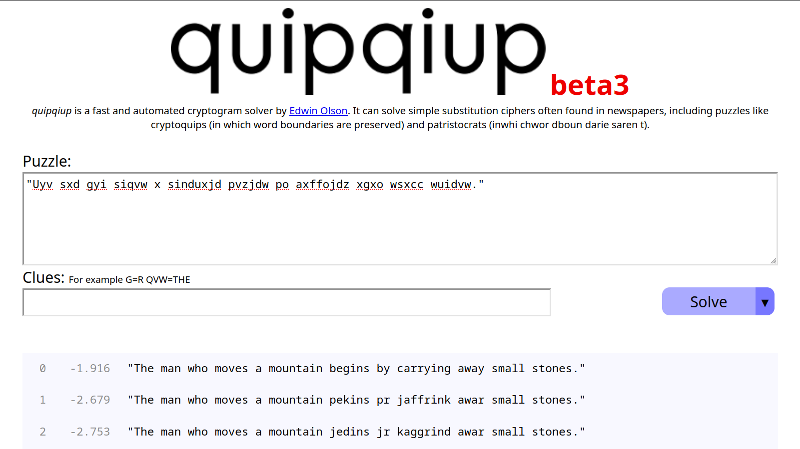

# Section 3 — Introduction to Cryptography

**🔗 Link:** [TryHackMe — Introduction to Cryptography](https://tryhackme.com/room/cryptographyintro)

---

### 🧠 What this section covers
> Learn about encryption algorithms such as AES, Diffie-Hellman key exchange, hashing, PKI, and TLS.

---

### 📘 Content
- Introduction

  This room introduced basic cryptography concepts, including symmetric encryption (AES), asymmetric encryption (RSA), Diffie-Hellman Key Exchange, hashing, and PKI.

  One of the simplest ciphers is the Caesar cipher, used more than 2000 years ago. Caesar Cipher shifts the letter by a fixed number of places to the left or to the right. Consider the case of shifting by 3 to the right to encrypt, as shown in the figure below.
  
  

  The recipient needs to know that the text was shifted by 3 to the right to recover the original message.

  

  Caesar Cipher: A substitution cipher shifting letters by a fixed key between 1–25. Example: encrypting “TRY HACK ME” with key 3 gives “WUB KDFN PH.” It can be broken using brute force by trying all possible keys.

  

  Transposition Cipher: Rearranges the order of letters based on a key. Example: message letters are written by columns and read by rows according to a key, producing a ciphertext different from substitution.

  

  Mono-alphabetic substitution cipher: Each letter maps to a unique letter. Example key “xpatvrzyjhecsdikbfwunqgmol” maps ‘a’→‘x’, ‘b’→‘p’, etc. Despite a large keyspace, this cipher can be broken using letter frequency analysis and dictionary knowledge, showing it is insecure for confidential communication.

  The ciphertext “Uyv sxd gyi siqvw x sinduxjd pvzjdw po axffojdz xgxo wsxcc wuidvw” can be decrypted without the key using tools like quipqiup, revealing the plaintext: “The man who moves a mountain begins by carrying away small stones.” This demonstrates that the algorithm is broken and unsuitable for confidential communication.

  

  Answer the questions below
  
  | Question | Answer |
  |-----------|--------|
  | You have received the following encrypted message: “Xjnvw lc sluxjmw jsqm wjpmcqbg jg wqcxqmnvw; xjzjmmjd lc wjpm sluxjmw jsqm bqccqm zqy.†Zlwvzjxj Zpcvcol You can guess that it is a quote. Who said it? |  | 

---

